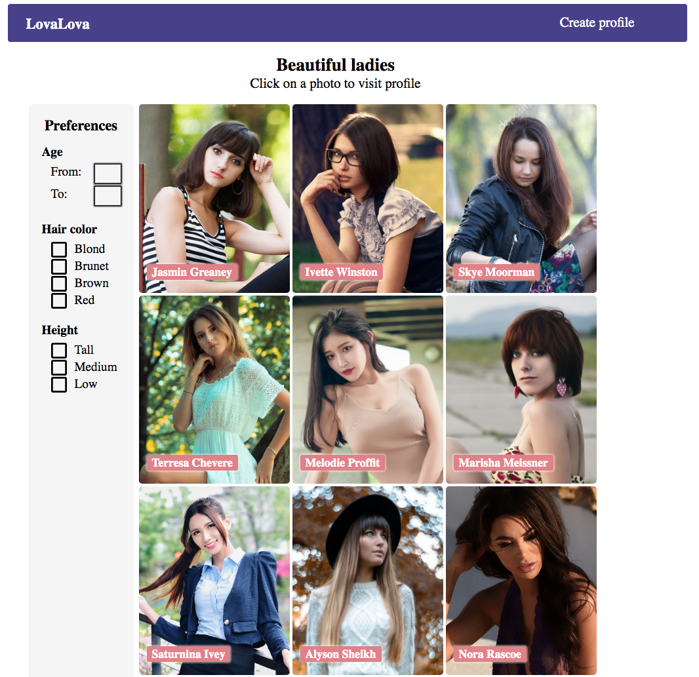

# LovaLova

## Сайт знакомств

### Реализованный функционал:

* Фильтр анкет по нескольким параметрам.
* Возможность написать понравившемуся участнику и поставить лайк. Список сообщений.
* Размещение на сайте собственного профайла.
* Загрузка фото из локального хранилища.
* Валидация форм: фильтры, создание нового пользователя.

### Инструкции по сборке
Находясь в папке проекта, выполнить последовательность команд:

* git clone git@github.com:tetenyov/lovalova.git
* npm i
* npm start

### Технологии

React, Redux, React Router

